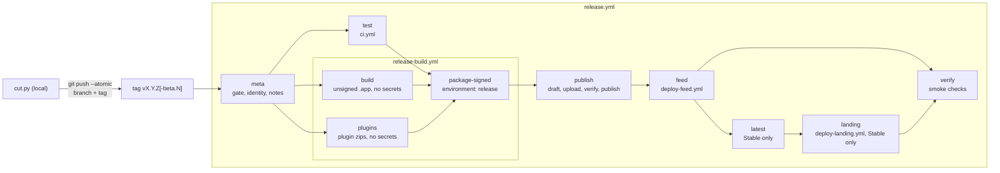

# Releasing on GitHub Actions

Releases are cut locally with `make release` and built, signed, notarized, and
published by GitHub Actions. Channel semantics, the version encoding, and the
branch model are described in [Beta Updates](beta-updates.md).

```bash
make release-dryrun [VERSION]   # preflight and plan; changes nothing
make release [VERSION]          # X.Y.Z (default: next Stable) or X.Y.Z-beta.N
```

`make release` runs [`scripts/release/cut.py`](../scripts/release/cut.py). Add
`YES=1` to skip its confirmation prompt.

**Pipeline switch.** [`release.yml`](../.github/workflows/release.yml) triggers on
every pushed `v*` tag, but its `meta` job runs only when the repository variable
`RELEASE_PIPELINE` equals `actions`; otherwise every job skips. `cut.py` refuses
to push a tag while the switch is off. Delete the variable to pause releases
without a commit.

## Pipeline

The maintainer's only local step is the cut. `cut.py` runs its preflight (including a
green `ci.yml` push run for HEAD; CI runs on pushes to `main` and `release/*-beta`), bumps
`Info.plist`, cuts `CHANGELOG.md` (Stable only), commits `chore: release vX.Y.Z`,
creates an annotated tag, and pushes the commit and tag in one atomic push. Everything
after the push happens in Actions, and Actions never writes to the repository.



| Job | Runner | Permissions | Secrets | What it does |
| --- | --- | --- | --- | --- |
| `meta` | ubuntu | `contents: read` | none | Validates the tag (strict format, annotated, peels to the checkout), ancestry (Stable: `origin/main`; Beta: `origin/release/X.Y-beta` and the latest published Stable), the tag commit's `Info.plist`, version monotonicity against published Releases, and tag trailers. Extracts release notes. |
| `test` | macOS | `contents: read` | none | Reuses `ci.yml` through `workflow_call` on the tag commit, skipping its universal build. |
| `build` | macOS (`xcode-27`) | `contents: read` | none | `build.sh` and `assemble.sh`: universal release build, assembled but unsigned `AnyDoor.app`. Uses no cache. |
| `plugins` | ubuntu | `contents: read` | none | `pnpm verify`, then deterministic `plugin-<id>.zip` archives. |
| `package-signed` | macOS (`xcode-27`) | `contents: read`, `id-token: write`, `attestations: write` | all release secrets | Developer ID signing, notarization and stapling of the app and DMG, Sparkle zip, appcast, `SHA256SUMS`, build provenance attestation. |
| `publish` | ubuntu | `contents: write`, `attestations: read` | none | Verifies `SHA256SUMS` and attestations, then `publish_release.py`: binds one draft by release id (the tag must peel to the built commit), uploads with retry and reconciliation, compares remote assets by sha256 digest, and publishes that id with `make_latest=false` once it is the tag's only release. |
| `feed` | ubuntu | `contents: read` | Cloudflare (`feed-production`) | [`deploy-feed.yml`](../.github/workflows/deploy-feed.yml): requires an immutable Release, verifies the `appcast.xml` asset against the release attestation, its feed signature against `SPARKLE_PUBLIC_ED_KEY`, and its content against the tag; rejects a rollback of either channel head; deploys it byte for byte and compares the live bytes. |
| `latest` | ubuntu | `contents: write` | none | Stable only: marks the Release as latest once the feed is live, so the GitHub `latest/download/appcast.xml` path (clients up to 4.1.0) moves together with the canonical feed. |
| `landing` | ubuntu | `contents: read` | Cloudflare (`landing-production`) | Stable only: [`deploy-landing.yml`](../.github/workflows/deploy-landing.yml) builds the site from the tag with the Release's `appcast.xml` as its version source and deploys it. |
| `verify` | ubuntu | `contents: read`, `attestations: read` | none | `gh release verify`; the live feed equals the asset; for Stable, the `latest/download/appcast.xml` path equals it too and anydoor.dev links the new DMG. |

Release runs share the `anydoor-release` concurrency group without cancellation:
each appcast is a read-modify-write of the previous feed, so releases must run one
at a time. Push one release tag at a time; GitHub creates no events when more than
three tags are pushed at once.

### Tag trailers

Optional Sparkle parameters travel in the annotated tag message, because a tag push
has no workflow inputs. `cut.py --phased-rollout-interval` and
`--critical-update-version` write them; `meta.py trailers` validates them strictly.

| Trailer | Value | `generate_appcast` option |
| --- | --- | --- |
| `Sparkle-Phased-Rollout-Interval` | positive integer seconds | `--phased-rollout-interval` |
| `Sparkle-Critical-Update-Version` | build-style version, or `*` | `--critical-update-version` |

## Trust boundaries

Only GitHub settings sit outside the tag's own code: the `release` environment's
required reviewer and `v*` deployment rule, the tag ruleset, and the repository and
environment variables that pin expected identities. Checks in `meta` and the scripts run code from
the tag commit, so they guard against mistakes, not against someone who can push a
crafted tag.

- **Build zone.** `build` runs SwiftPM dependencies, build plugins, and macros; `plugins`
  runs pnpm dependencies. Neither job has secrets, write permissions, or a cache that
  another ref could have populated. Their outputs are data to the signing job.
- **Signing zone.** `package-signed` is the only job in the `release` environment and
  holds both Apple and Sparkle secrets, so a release needs exactly one approval. It
  refuses to run on anything but a GitHub-hosted runner and executes no binary from an
  upstream artifact: it fetches the Sparkle tools itself and verifies their SHA-256
  against `release.conf`, and installs Python dependencies from `uv.lock` before any
  secret is present. Before signing, `meta.py verify-app` requires the assembled
  `Contents/Info.plist` to byte-equal the tag commit's `Info.plist` and its
  `SUPublicEDKey` to equal the `SPARKLE_PUBLIC_ED_KEY` repository variable, so the
  build zone cannot swap the update key.
- **Trusted code in the signing zone.** Every step of `package-signed` runs as the same
  user on the same disk, so anything it executes could read a later step's secret or
  rewrite a later step's script. Its trusted code is therefore the tag's scripts,
  Apple's tools, the checksum-pinned Sparkle tools, and the Python packages pinned by
  hash in `scripts/release/uv.lock` (`cryptography`, `dmgbuild`, `ds_store`,
  `mac_alias`). Review changes to that lockfile as you would changes to the signing
  scripts. The pipeline does not try to sandbox `dmgbuild` inside the job; locking the
  keychain around it would not contain code running as the same user.
- **Secret handling.** Each secret appears only in the `env:` of the step that uses it.
  The Developer ID identity lives in a temporary keychain with a per-run password that
  is never written to disk, imported non-extractable and available to `codesign` only;
  the `.p12` is deleted immediately after import. `notarize.sh` writes the App Store
  Connect key to a private file it deletes when the step ends. The Sparkle private key
  reaches `generate_appcast` and `sign_update` only on stdin, in a fresh empty directory.
- **Publish zone.** `publish` and `latest` are the only jobs with `contents: write`;
  `latest` only flips the latest marker. It runs no Swift
  or pnpm code, and verifies checksums and attestations before creating anything.
  GitHub allows several drafts for one tag, so it addresses its own draft by release
  id, never by tag name, and refuses to publish while any other release exists for the
  tag.

- **Deploy zone.** `feed` and `landing` hold the Cloudflare credentials, as
  secrets of the `feed-production`, `feed-manual`, and `landing-production`
  environments, never at repository level. They run no Swift code and deploy
  only content that the earlier zones produced and attested.

**Single maintainer.** The maintainer both pushes the tag and approves the
environment, so approval is a deliberate confirmation step, not separation of duties.
The real protections are the account's own security (2FA, a token without admin
scope for daily use) and the pinned identities above.

## Appcast as a Release asset

Every Release carries the complete `appcast.xml` that becomes the live feed.

1. **Seed.** `seed-feed.sh` downloads `appcast.xml` from the most recently published
   Release of either channel (`meta.py verify-monotonic` reports it as `previous_tag`).
   For an immutable Release it also runs `gh release verify-asset`. The seed must
   byte-equal the live feed at `https://anydoor.dev/appcast.xml`; a mismatch means the
   last feed deployment did not complete, and the release stops.
   Equality is not authentication: anyone with repository write access can replace a
   mutable Release asset and redeploy the feed, and step 3 re-signs every carried-over
   item. So the seed's own feed signature must verify with `SPARKLE_PUBLIC_ED_KEY`.
   The only unsigned seed accepted is the old local flow's last feed, named by
   `LEGACY_UNSIGNED_FEED_TAG` in `scripts/release/release.conf` (or a `--from-git`
   seed); for it, `seed-feed.sh` downloads every enclosure and verifies its
   `sparkle:edSignature` and length instead. Rehearsals report authentication
   failures as warnings.
2. **Generate.** `appcast.sh` runs Sparkle's `generate_appcast` over the seed, the new
   zip, and the release notes, keeping `APPCAST_MAX_VERSIONS` items per branch, embedding
   the notes, and adding `--channel beta` for a Beta tag. `set-appcast-display.py` then
   writes the display version.
3. **Sign last.** `sign_update` signs the whole feed (Sparkle 2.9 signed feeds). This is
   the final write; everything after it only reads.
4. **Verify.** `validate-appcast.py`, `verify-feed-publication.py` (no rollback of
   either channel head against the seed), and `verify_sparkle_signatures.py` check the
   enclosure signature and length and the feed signature against the pinned public key.
5. **Publish.** The asset is uploaded with the DMG, zip, plugin zips, and `SHA256SUMS`.
   The `feed` job then deploys this asset byte for byte.

Clients up to 4.1.0 still read `releases/latest/download/appcast.xml`, so every Release
keeps the asset, and the feed bytes deployed live must equal it.

## Rehearsing

| Level | Entry point | Covers | Secrets |
| --- | --- | --- | --- |
| Unit tests | `make release-tools-check` | `scripts/release/tests/`: meta gate, cut, zip determinism, DMG layout, Sparkle round trip and seed authentication, release publication by id, shell boundaries | none |
| Cut plan | `python3 scripts/release/cut.py --dry-run` | Preflight, inferred version, changelog and plist changes, push refspec, notes preview | none |
| Local build | `scripts/release/rehearse.sh` | The `package-unsigned` job on your Mac | none |
| Pull request | `release-rehearsal.yml` | Same as the local build, on the release runner image | none |

`make release-tools-check` runs
`uv run --locked --project scripts/release python -m unittest discover -s scripts/release/tests`;
CI runs the same command in its `release-tools` job.

`scripts/release/rehearse.sh [--skip-build] [--out DIR]` rehearses the next Beta
identity without touching the repository's `Info.plist` or `CHANGELOG.md`. Both
rehearsals use `meta.py rehearsal-identity`: `X.Y.(Z+1)-beta.1` after the highest of
`Info.plist` and every published release, so a rehearsal on `main` still passes the
monotonic gate while Betas from a `release/X.Y-beta` branch are out. An empty
`[Unreleased]` section is replaced by placeholder notes with a warning. It builds and assembles the app, writes the rehearsal
version and a throwaway Sparkle public key into the app copy, signs ad hoc, packages
the zip, DMG, and plugins, seeds from the latest published Release, and generates and
verifies an appcast signed with the throwaway key. Artifacts go to
`.build/release-rehearsal` by default. It needs macOS, `uv`, `pnpm`, an authenticated
`gh`, and network access; nothing is signed with a real identity or published.

The PR rehearsal runs automatically for changes under `scripts/release/`, the shared
release scripts, `.github/workflows/release*.yml`, `.github/actions/`, the toolchain
pin, `Package.swift`, `Package.resolved`, `Info.plist`, `Resources/`, and `tooling/`.
Dispatch it manually with `workflow_dispatch` to rehearse `main`.

Neither rehearsal exercises Developer ID signing, notarization, the real Sparkle key,
`publish`, or the deployments. The first real run is the cutover Beta.

## Repository setup

These are repository-setting and credential changes. Each one needs the owner's
explicit go-ahead; nothing in this repository performs them.

1. **Immutable releases.** Settings → General → Releases → "Enable release
   immutability". Immutability applies only to Releases published afterwards; the
   feed deployment accepts immutable Releases only.
2. **Environment `release`.** Settings → Environments → New environment:
   - Required reviewer: the maintainer. Clear "Allow administrators to bypass
     configured protection rules".
   - Deployment branches and tags: "Selected branches and tags", one rule with ref type
     **Tag** and pattern `v*`. No branch rules.
3. **Environment secrets** (in `release`, never repository-level):

   | Secret | Content |
   | --- | --- |
   | `DEVELOPER_ID_P12_BASE64` | Base64 of the Developer ID Application `.p12` (consider a CI-only certificate so a CI compromise revokes only that one) |
   | `DEVELOPER_ID_P12_PASSWORD` | The `.p12` export password |
   | `ASC_API_KEY_P8` | Contents of the App Store Connect Team API key `.p8` (least-privileged role that can notarize; confirm on the first submission) |
   | `SPARKLE_ED_PRIVATE_KEY` | The existing Sparkle EdDSA private key, exported as below |

4. **Variables.** Environment variables reach only jobs that reference the
   environment, so the variables that `meta` and `feed` also read are repository
   variables. Both kinds are editable by admins only.

   | Variable | Level | Content |
   | --- | --- | --- |
   | `ASC_API_KEY_ID` | environment `release` | The API key ID |
   | `ASC_API_ISSUER_ID` | environment `release` | The App Store Connect issuer ID |
   | `DEVELOPER_ID_SHA1` | environment `release` | SHA-1 of the signing identity, from `security find-identity -v -p codesigning` |
   | `SPARKLE_PUBLIC_ED_KEY` | repository | The public key; must equal `SUPublicEDKey` in `Info.plist`. Read by `meta`, `package-signed`, and `feed`; do not also define it in an environment, where it would shadow the repository value. |
   | `RELEASE_PIPELINE` | repository | `actions` turns the pipeline on (see the pipeline switch above) |

5. **Deployment environments.** Each holds the `CLOUDFLARE_API_TOKEN` and
   `CLOUDFLARE_ACCOUNT_ID` secrets. Delete the repository-level copies once all
   three have them: a reusable workflow does not receive repository secrets, and
   environment secrets keep the token away from pull request and branch runs.

   | Environment | Deployment rule | Reviewer | Used by |
   | --- | --- | --- | --- |
   | `feed-production` | tag `v*` | none | `release.yml` → `deploy-feed.yml` |
   | `feed-manual` | branch `main` | maintainer | `Update Feed` dispatch: redeploy a Release's feed |
   | `landing-production` | tag `v*`, branch `main` | none | `release.yml` → `deploy-landing.yml`, and its dispatch |

6. **Cloudflare Workers Builds.** Disconnect the Git integration of the landing
   Worker, so that only `deploy-landing.yml` deploys the site.
7. **Tag ruleset** on `refs/tags/v*`: restrict creations, updates, and deletions, and
   block force pushes, with bypass for the repository admin role only. Actions never
   creates tags, so it needs no bypass.
8. **Fork pull requests.** Require approval for workflows from all outside
   collaborators, so the macOS rehearsal cannot be triggered freely.
9. **Actions SHA pinning.** Require actions to be pinned to a full commit SHA.

### Exporting the Sparkle key through a RAM disk

`generate_keys -x` writes the private key in plain text. APFS on an SSD cannot
securely erase a file, and the home folder may be backed up or synced, so export to a
RAM disk that never touches persistent storage:

```bash
dev="$(diskutil image attach --noMount ram://8192)"   # 4 MB
diskutil erasevolume HFS+ SparkleKey "$dev"
mdutil -i off /Volumes/SparkleKey

generate_keys -x /Volumes/SparkleKey/sparkle.key
generate_keys -p   # must print the SUPublicEDKey from Info.plist
gh secret set SPARKLE_ED_PRIVATE_KEY --env release < /Volumes/SparkleKey/sparkle.key

diskutil eject "$dev"
```

On macOS releases without `diskutil image`, attach with
`hdiutil attach -nomount ram://8192` and eject with `hdiutil detach`.

Use the same RAM disk for the `.p12` and `.p8` files (`base64 -i cert.p12 | gh secret
set DEVELOPER_ID_P12_BASE64 --env release`). Keep the Sparkle key in the login
keychain or offline media as the backup; GitHub secrets cannot be read back. `generate_keys`
is in `scripts/sparkle-bin/` after `make sparkle-tools`.

## Cutover

The old local driver, which built, signed, and published on the maintainer's Mac,
was removed with the commit that wired `make release` to `cut.py`. Its last
Release, v4.2.7, published an unsigned feed; `LEGACY_UNSIGNED_FEED_TAG` in
[`release.conf`](../scripts/release/release.conf) names it so the first pipeline
release can seed from it. Steps to the first Actions release:

1. Complete the [repository setup](#repository-setup).
2. Set the repository variable `RELEASE_PIPELINE` to `actions`.
3. Cut a Beta as the first Actions release: `make release X.Y.Z-beta.1` from
   `release/X.Y-beta`. Approve `package-signed` when asked. Confirm on real hardware
   that the annotated tag survived checkout, the keychain signed without prompts,
   the API key's role was sufficient, and the previous Stable updates to the Beta.
4. After the first pipeline Stable, consider enforcing signed feeds in the app
   (`SURequireSignedFeed` with `SUVerifyUpdateBeforeExtraction`): every feed from
   then on carries a signature.

## Failure and recovery

A pushed tag never moves and is never deleted: the ruleset forbids it, and an
immutable Release locks it. A tag that fails before publication is void; cut the next
version (Stable patch+1, or Beta N+1). Version gaps are acceptable. When a void Stable
tag leaves a `## [X.Y.Z]` changelog section that was never released, the next
`cut.py` run folds it into the new section and shows this in its plan.

Use **Re-run failed jobs**, not "Re-run all jobs": earlier jobs' artifacts stay valid,
and a re-run `meta` repeats its ancestry checks against the current branches. Signed
runs keep the unsigned app, plugin, notes, and release-asset artifacts for 7 days, so
approve `package-signed` and re-run failed jobs within 7 days of the tag push;
after that, cut the next version.

| Failure | Recovery |
| --- | --- |
| `meta` gate (tag format, ancestry, `Info.plist`, monotonicity, empty notes) | Nothing was built. Fix the cause and cut the next version. |
| `test` | Fix on the branch and cut the next version. |
| Problem noticed while approval is pending | Reject the deployment, then cut the next version. |
| Notarization `Invalid` | Read the uploaded notary log, fix signing or code, and cut the next version. |
| Notarization timeout or Apple outage | Re-run failed jobs; `package-signed` resubmits. The log prints the submission ID. |
| Seed differs from the live feed | The previous feed deployment did not finish. Redeploy the previous Release's feed, then re-run failed jobs. |
| `publish` fails while the Release is a draft | Re-run failed jobs; `publish_release.py` adopts the tag's single draft, keeps assets whose digest matches, and replaces the rest. Deleting a leftover draft is harmless. |
| `publish` reports several releases for the tag | Someone else created a draft for the tag. Inspect and delete the extra drafts, then re-run failed jobs. |
| Seed has no valid feed signature | The previous Release's `appcast.xml` or the live feed was not produced by the pipeline. Investigate before releasing; never relax the check to get past it. |
| Published, but the feed deployment failed | Re-run failed jobs: `feed`, then `latest`, `landing`, and `verify`. Never republish or delete the Release. If the run can no longer be re-run, dispatch `Update Feed` with the tag (approval in `feed-manual`), then mark the Release latest and dispatch `Landing` for a Stable. The feed never rolls back; fix a bad release with the next version. |
| `latest` or `landing` failed | Re-run failed jobs. The feed is already live, so clients update meanwhile; only the GitHub latest path and the website lag. |
| A published release is broken | Ship the next version promptly, with a `Sparkle-Critical-Update-Version` trailer if needed. |
| A bug in the workflow itself | A tag runs the workflow from its own commit. Merge the fix and cut the next version. |
| `release/X.Y-beta` was deleted before a re-run | Re-run only the failed jobs, which skips `meta`'s ancestry check. |
